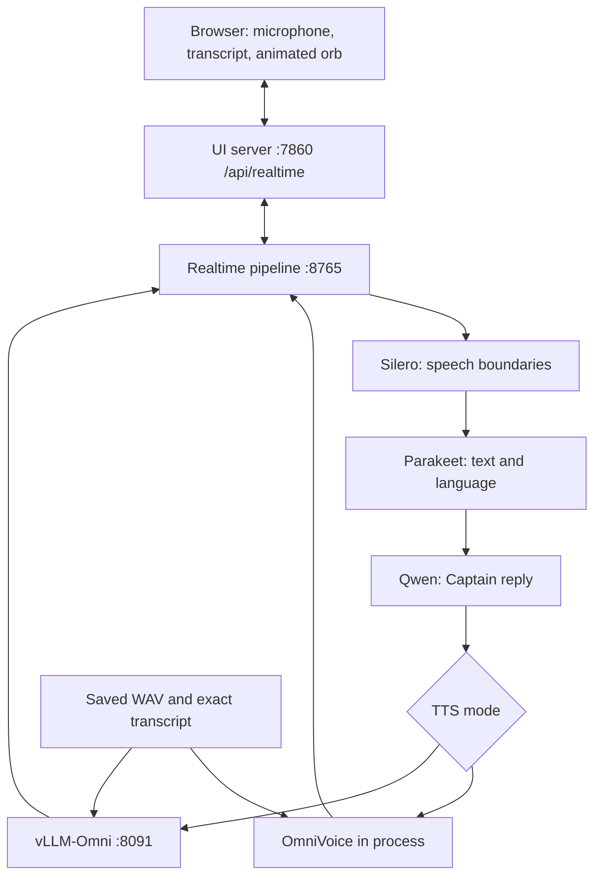

# Captain — multilingual pirate voice demo

Speak to the Captain; get a short pirate reply in the language of your latest
message, using the same saved reference voice. This completes the attached
handoff around Hugging Face speech-to-speech and OmniVoice.

**Validation:** 30 Python tests and 7 JavaScript tests pass. Both Docker Compose
configurations validate, and backend dependencies resolve. GPU inference,
container builds, browser microphone playback and a physical Reachy Mini were
not run in the development environment. See [REPORT.md](REPORT.md).

## Start the demo

Use a Linux x86_64 NVIDIA GPU machine with Docker Engine, Compose 2.30+, and
NVIDIA Container Toolkit. The main image uses PyTorch CUDA 12.8 wheels; the host
needs a compatible NVIDIA driver. Allow several tens of GB for images, weights
and cache. 24 GB VRAM is a planning estimate with headroom, **not a measured
minimum**. You can move the LLM to a remote endpoint to reduce GPU use.

```bash
cp .env.example .env
docker compose up --build -d
docker compose logs -f voice-init s2s ui
```

First startup downloads models, creates a reference voice and warms the pipeline.
This can take many minutes. `voice-init` should exit successfully; `s2s` must
become healthy before `ui` starts. Open **http://localhost:7860**, click the orb,
allow the microphone, then speak. Headphones help avoid acoustic feedback.
The Captain waits for you to speak first, so it does not guess your language.

```bash
docker compose ps -a
curl --fail http://localhost:7860/api/health
```

The health response should contain `"ready": true`. Health confirms that the
backend API and SDK bundle are available; it is not a voice-quality test.
The default configuration serves one conversation at a time.

Stop without deleting the model cache or voice:

```bash
docker compose down
```

## Use it from another computer

The default port binds to loopback. For a GPU server, use an SSH tunnel from
your laptop, then open `http://localhost:7860` on the laptop:

```bash
ssh -L 7860:127.0.0.1:7860 YOUR_USER@YOUR_GPU_HOST
```

For a LAN deployment, use an HTTPS reverse proxy that supports WebSocket
upgrades. Plain HTTP on a LAN IP will not provide browser microphone access.
The browser always connects to `/api/realtime` on the UI's own origin; it never
needs to resolve the Docker hostname `s2s`. The proxy must preserve `Host` and
`Origin`. Add authentication before making this local demo a public service.

## Choose the Captain's voice

`voice-init` generates **one** English reference with supported voice-design
attributes: male, elderly, very low pitch and British accent. Later launches
reuse that WAV and transcript. It does not redesign the voice per language.
Generated pitch and age do not guarantee a gravelly performance.

For a particular gravelly voice, supply a recording you have permission to use:

- `voices/pirate_ref.wav`: mono, 24 kHz, 16-bit PCM, 3–10 seconds.
- `voices/pirate_ref.txt`: the exact spoken transcript, UTF-8.

Provide both before startup. Invalid or incomplete pairs fail clearly instead
of silently substituting a different voice. To change voices, stop the stack,
move the previous reference files aside, supply the new pair, then restart.
No reference recording or model weights are bundled in this ZIP.

Edit `hf-realtime-voice/pirate.json` to change the default persona, then rebuild.
The browser's Instructions setting can override its session prompt. The voice
selector remains locked to Captain. Instructions use a separate storage prefix
so a previous generic HF Voice session cannot silently restore an old persona.

## Optional: separate vLLM-Omni TTS service

```bash
docker compose down
docker compose -f compose.yaml -f compose.vllm.yaml up --build -d
```

This adds the official `vllm/vllm-omni:v0.28.0` image. That image uses CUDA 13.0
binaries, so check host driver compatibility separately from the main image.
It shares the same reference files, mounted read-only, and receives
`ref_audio`, `ref_text` and the detected language on each speech request.
Output is non-streaming WAV. The speech backend still turns it into realtime
audio events. This optional mode has configuration and adapter tests, **not a
completed GPU run**. It is not a demonstrated latency improvement.

The configured GPU memory fraction is 0.35 for vLLM-Omni. Both inference
services share the available GPU by default; adjust placement/memory for your
hardware, or use a remote LLM. Do not assume this allocation fits every GPU.

## Optional: remote LLM

In `.env`, set `LLM_BASE_URL` to an OpenAI-compatible chat-completions base URL,
set `LLM_MODEL` to a model served there, and set `OPENAI_API_KEY` if required.
Then recreate the containers with `docker compose up -d`.
The key stays in the backend environment. It is not returned to the browser or
printed in the launch command. With an empty base URL, the default LLM is local
`Qwen/Qwen3-4B-Instruct-2507`. Custom providers may require different reasoning
settings; the launch script is the place to adjust those backend flags.

## Smoke test on your GPU host

End any browser conversation first so the single pipeline is free:

```bash
docker compose exec s2s python scripts/smoke_realtime.py \
  --url ws://ui:7860/api/realtime \
  --text "Bonjour capitaine, où allons-nous aujourd'hui ?" \
  --output /voices/captain-smoke.wav
```

Listen to `voices/captain-smoke.wav`. The script requests an actual generated
reply, validates received PCM and prints the transcript plus measured time to
first audio. It exercises LLM → TTS → relay. It deliberately does not claim to
test the microphone or STT. No synthetic speech fixture is used by this command.

Then check spoken English, French, German, Spanish and Italian in the browser;
switch languages within a conversation, interrupt a reply, end the call, and
reconnect. Verify intelligibility, stable perceived speaker identity and no
stale audio after interruption. Use a full sentence on the first turn and when switching languages. The pinned
Parakeet handler skips language detection for transcripts shorter than 20
characters and uses its last language (initially English); short greetings can
therefore receive a reply in that language. The STT stage supports the 25 languages in
[Parakeet's model card](https://huggingface.co/nvidia/parakeet-tdt-0.6b-v3), not
literally every European language.

## Architecture and modules



| Module | Responsibility |
| --- | --- |
| `hf-realtime-voice/main.js`, `index.html`, `style.css` | Captain UI, instructions, microphone controls and existing audio-reactive orb |
| `s2s-realtime-client.js`, `ws/`, `worklets/` | Agents SDK transport, transcripts, 24 kHz PCM16 capture and playback |
| `server.py`, `realtime_proxy.py` | Static UI, readiness, same-origin WebSocket relay and inherited optional service helpers |
| `scripts/prepare_voice.py`, `voice_files.py` | Create once or validate/reuse the reference voice |
| `scripts/launch_backend.py` | Build the pinned backend's CLI arguments without shell interpolation |
| `patches/remote-voice.patch` | Forward clone audio/text and per-turn language to remote TTS |
| `patches/omnivoice-dependencies.patch` | Exclude the unused Qwen GGML extra that prevented portable dependency resolution |
| `compose.yaml`, `compose.vllm.yaml` | Startup order, GPU allocation, persistent voice/cache and service networking |
| `scripts/smoke_realtime.py` | Save a real backend reply for deployment acceptance |

The wire format is 24 kHz mono PCM16. The upstream internal pipeline uses
16 kHz audio and handles conversion at its boundaries. VAD finds speech and
silence; this demo does not perform speaker diarization. OmniVoice generates
complete sentence batches before they can be played, so time to first audio
still depends on generation latency. There are **no robot movement tools** in
this package; Reachy audio/control integration is separate.

## Run the automated tests without a GPU

Python 3.11+, Node 22+ and Git are required:

```bash
python3 -m venv .venv
. .venv/bin/activate
pip install -r requirements-test.txt
cd hf-realtime-voice
npm ci
npm test
cd ..
pytest -q tests
docker compose config --quiet
docker compose -f compose.yaml -f compose.vllm.yaml config --quiet
```

Tests cover reference validation/reuse, launch arguments, HTTP readiness,
WebSocket JSON/binary forwarding and teardown, remote clone/language payloads,
audio framing at three input sample rates, and the deployment smoke client.
Heavy models are omitted from unit tests; protocol fixtures are identified as
fixtures and are not used by the shipped application.

## Versions and provenance

- Speech backend: commit `ca5c33c9bb5e381288d315d1f8da122613845c4c`, plus two small patches applied during the image build.
- OmniVoice package: `0.2.1`; PyTorch/torchaudio: `2.8.0`; Transformers: `5.15.1`.
- `requirements-backend.lock`: 124 resolved distribution versions for Python 3.11 / Linux x86_64. Core pins are also recorded in `constraints-backend.txt`.
- Browser SDK: existing npm lock, `@openai/agents` `0.14.3`.
- Optional vLLM-Omni image: `v0.28.0`.

Dependency resolution is checked; a Docker build is still needed on the target
host. Container base images are version-tagged rather than digest-pinned; model
IDs download their current Hub revisions on first use. This is not a fully
hermetic offline bundle. `reference/` and `GOAL.md` preserve the original handoff;
use this README for the finished launch instructions.

OmniVoice's code and weights have different licenses. The
[model card](https://huggingface.co/k2-fsa/OmniVoice#license) states that the
pretrained weights are CC-BY-NC. Check suitability before commercial use.
See [NOTICE.md](NOTICE.md) for source attribution.
